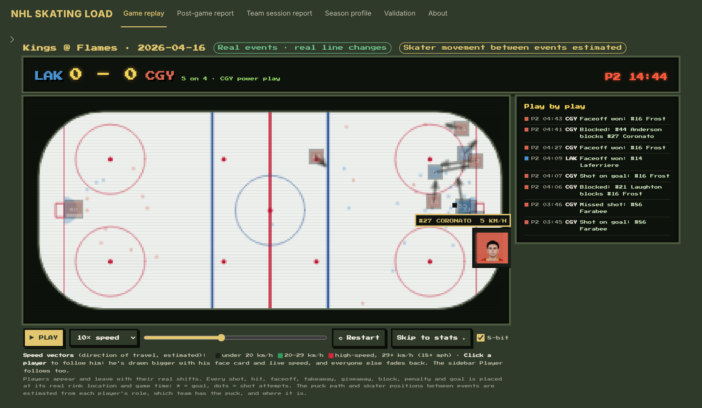
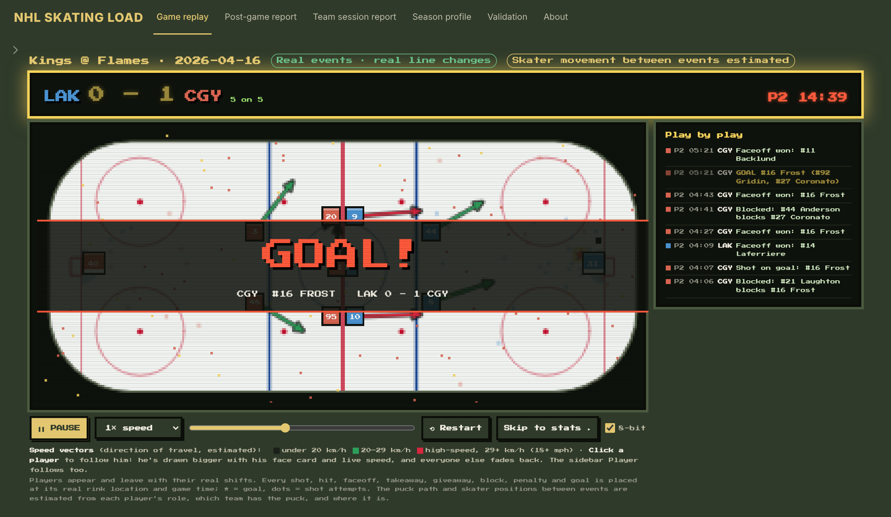
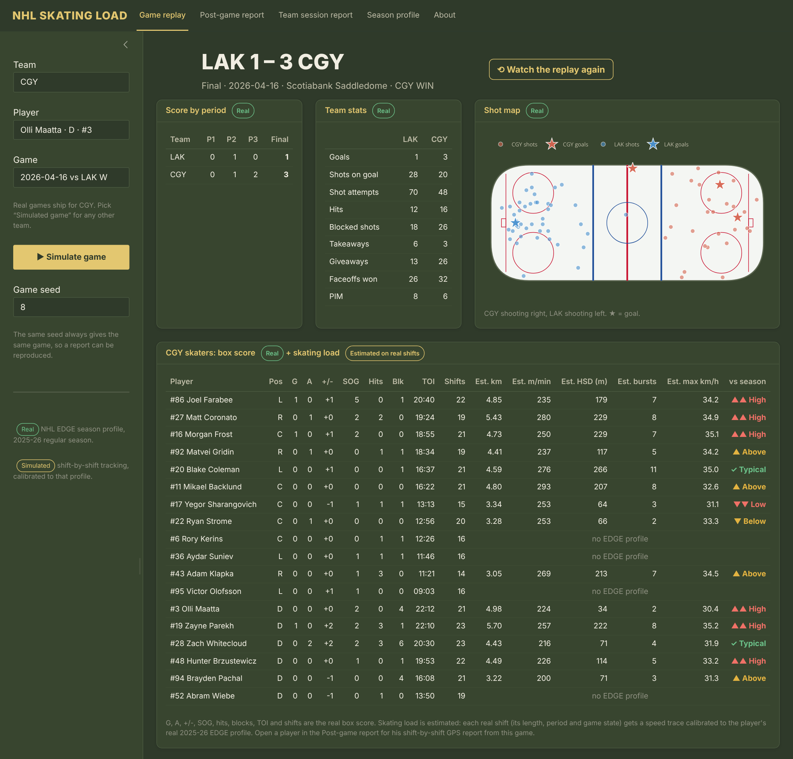
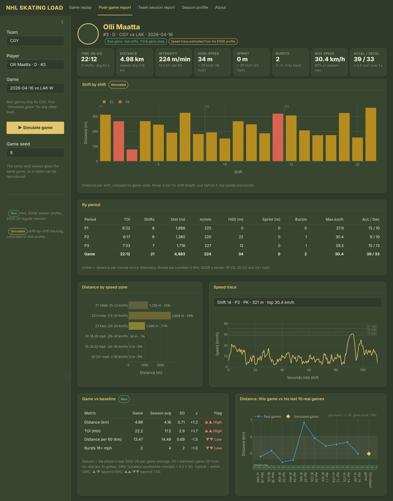
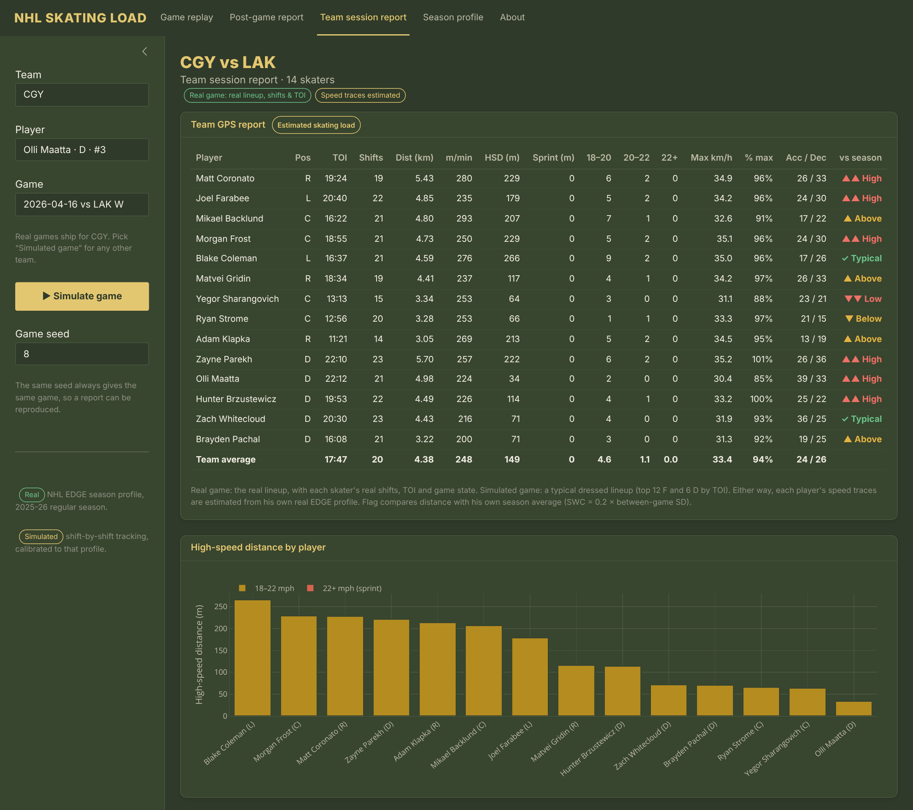
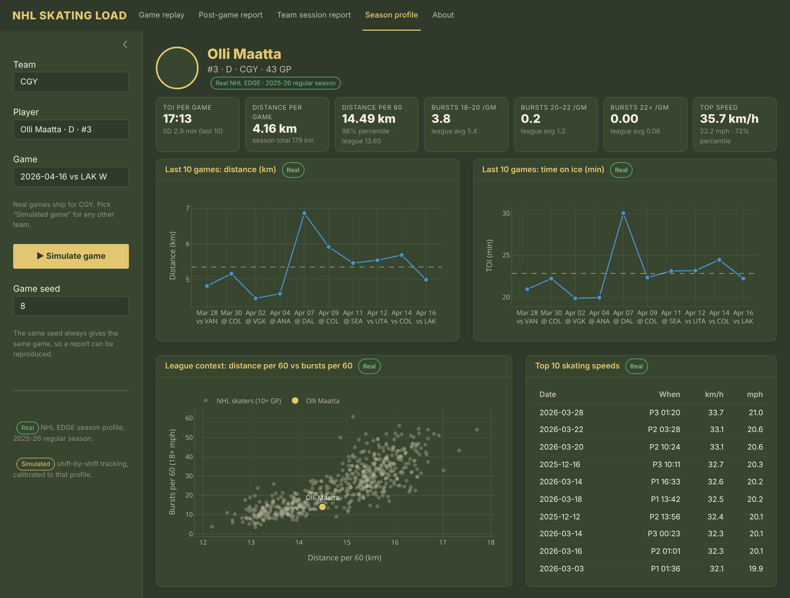
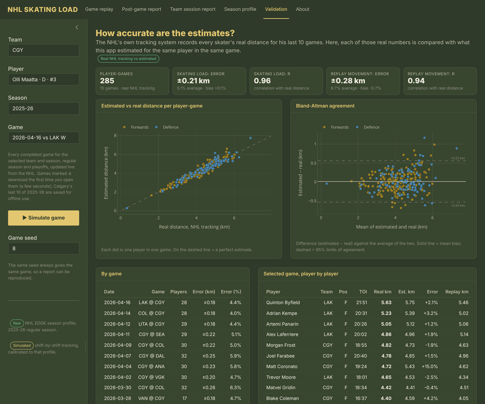

# NHL Skating Load (Shiny for Python)

[](https://natekolbsportscience-nhl-skating-load.share.connect.posit.cloud)

**[Open the live app](https://natekolbsportscience-nhl-skating-load.share.connect.posit.cloud)**: nothing to install. Pick any team and any completed game. It may take a few seconds to wake up.



Real NHL games replayed on a rink, followed by the post-game report a sport scientist would hand to coaches and medical staff.

Pick any NHL team and any completed game (regular season or playoffs) and watch it play out on the ice. Every shot, hit, faceoff, takeaway, giveaway, block, penalty and goal appears at its **real location and game time**, and players come on and off with their **real shifts**. When the final horn sounds, the app switches to the post-game stats: the real box score, team stats and shot map, plus each skater's **estimated skating load** from the game.

> **Real vs estimated.** The NHL publishes play-by-play with x/y locations, shift charts, box scores and season-level skating data (**NHL EDGE**). It does **not** publish continuous player tracking. So in the replay, the puck path and skater positions between events are estimated, and skating load (distance, high-speed distance, bursts) is modelled on each player's real shifts from his real EDGE profile. The app labels each panel as Real or Estimated/Simulated.
>
> **Next step: optical tracking.** The movement and speed vectors in the replay are a model, not what happened on the ice. The goal for the next version is to drive them with optical player-tracking data, so skater paths, speeds and accelerations match the real play frame by frame (see [Roadmap](#roadmap)).

---

## What's in the app

| Page | What it shows |
|---|---|
| **Game replay** | A 2D rink with both teams' skaters and goalies, the puck, a scoreboard (score, period, clock, 5-on-5 / power play) and a live play-by-play feed. There's play/pause, speeds from 1× (real time) to 240×, a scrubber, and a pause on every goal. An **8-bit mode**, on by default, gives it a retro arcade look; untick it for a clean view. Shots and goals build up into a shot map as the game goes. Each skater carries a **speed vector** (direction of travel, coloured by speed band: under 20 km/h, 20–29 km/h, 29+ km/h high-speed). Goals trigger an 8-bit **GOAL!** banner on the rink and a flashing scoreboard. **Click any player** to follow him: he's drawn bigger with his face card and live speed, and everyone else fades back. When the replay ends, or you hit **Skip to stats**, it shows the post-game stats: score by period, team stats, the shot map and the skater box score with estimated skating load. |
| **Post-game report** | One player's GPS-style report for the selected game. Tiles: TOI, distance, m/min, high-speed and sprint distance, bursts by band, max speed, accelerations and decelerations. Charts: distance per shift (ES / PP / PK), period split, distance by speed zone, a 10 Hz speed trace for any shift, and **game vs baseline** with SD and SWC flags. In a real game his shifts, TOI and game state are real; choose "Simulated game" to generate one for any skater in the league. |
| **Team session report** | The whole lineup in one GPS table with high-speed distance by player, each flagged against his own season average. |
| **Season profile** | The player's real EDGE profile: TOI, distance per game and per 60 (league percentile), bursts per game against the league average, top speed, last 10 games, top 10 speeds, and where he sits league-wide. |
| **Validation** | The estimates checked against the NHL's real per-game tracking: estimated vs real distance, a Bland-Altman plot, and errors by game and by player. |
| **About** | Method and metric definitions. |











## Validation against real NHL tracking

NHL EDGE publishes each skater's **real tracked distance for his last 10 games**. Over Calgary's last 10 games of 2025-26 (285 player-games, both teams), the app's estimates compare with those real numbers like this:

| | Average error | Bias | Correlation |
|---|---|---|---|
| Post-game skating-load estimate | ±0.21 km (5.1%) | +0.1% | r = 0.96 |
| Distance implied by the replay's movement | ±0.28 km (6.7%) | −0.7% | r = 0.94 |



What this shows: a player's real shifts plus his season skating intensity predict his real game distance to within about 5%. What it doesn't show: that the estimate captures how hard he skated on a given night. His season distance per 60 already includes these games, and ice time (which is real) drives most of the game-to-game difference. Speeds, bursts and positions aren't published per game, so they can't be checked. The replay movement has a single league-wide drift setting, tuned so its average distance matches real tracking.

## Quick start

```bash
git clone https://github.com/NateKolbSportScience/NHL-Skating-Load.git
cd NHL-Skating-Load
pip install -r requirements.txt
shiny run app.py
```

Then open http://127.0.0.1:8000. The replay of Calgary's most recent game loads first: hit **▶ Play**. In the sidebar, pick any **Team** and **Season**, and the **Game** list fills with every completed game, live from the NHL. A game downloads the first time you open it (a few seconds) and is saved in `data/games/`. Pick **Simulated game** to generate one for any player in the league; the same seed always reproduces the same game.

## Staying current

- **Games** come straight from the NHL API, so new games show up in the Game list as soon as they're final, including the new season. Calgary's last 10 games of 2025-26 ship with the repo, so the app also works offline.
- **Skating profiles (NHL EDGE)** are bundled as weekly snapshots. A GitHub Action (`.github/workflows/refresh-edge.yml`, also kept at `tools/refresh-edge.yml`) pulls the current season's profiles every Monday and commits them. Early in a season, a player keeps his previous-season profile until he has 10+ games, then switches to the new one.

To refresh by hand (free, no API key, takes a few minutes):

```bash
python tools/fetch_edge.py --season 20262027   # current-season EDGE profiles
python tools/fetch_games.py --team EDM --last 5  # pre-download games for offline use
```

## How the replay is built

| Real (NHL API) | Estimated |
|---|---|
| Every event's type, game time and x/y location | Puck path between events (straight lines with a little drift) |
| Who is on the ice every second (shift charts) | Skater positions between events |
| Score, period, clock, power plays | |
| Box score | Skating load per player (see below) |

Each skater moves toward a target spot set by his role (C, wing or D), which team has the puck, and where it is. Attacking forwards support the puck and the D hold the blue line; defenders collapse between the puck and their net. Skaters are limited to realistic speeds, line up for every real faceoff, and come off the bench on their real shift changes.

## How skating load is estimated

The real profile drives the simulation:

| From NHL EDGE (real) | Used for |
|---|---|
| Distance per 60: all, ES, PP, PK | Skating intensity in each game state |
| Distance in each state | Share of shifts at ES / PP / PK |
| TOI and last-10-game TOI SD | Time on ice for the game |
| Last-10-game distance per 60 | Game-to-game variation in intensity |
| Bursts 18–20 / 20–22 / 22+ mph | Burst rate per hour in each band |
| Top speed | Cap on burst peaks |

1. **Shifts.** In a real game, these are the player's **real shifts**: start time, length, period, and game state from the play-by-play situation codes. In a simulated game, TOI is drawn from his real average and SD, and shifts average about 48 s for forwards and 54 s for D.
2. **Speed trace.** Each shift gets a 10 Hz speed trace. Baseline skating is a mean-reverting random process, and bursts are acceleration–hold–deceleration profiles with peaks inside EDGE's bands.
3. **Calibration.** Baseline speed is scaled so every shift hits the player's real distance per 60 for that game state, with a small third-period drop-off.
4. **Metrics.** Bursts, high-speed distance, zones and accelerations are measured from the trace, the same way a tracking system would.

Over many simulated games, distance per 60, TOI and burst counts average out to the player's real EDGE numbers. For Connor McDavid over 40 simulated games: 16.9 vs 16.9 km per 60, 23.0 vs 23.0 min TOI, and 11.9 / 6.5 / 1.8 bursts per game vs his real 11.2 / 6.5 / 1.8.

## Metrics

| Metric | Definition |
|---|---|
| **m/min** | Distance per minute on ice (intensity) |
| **HSD** | High-speed distance: at or above 18 mph (29 km/h), EDGE's lowest burst band |
| **Sprint** | Distance at or above 22 mph (35.4 km/h) |
| **Bursts** | Each excursion above 18 mph, classified by peak into EDGE's bands (18–20, 20–22, 22+ mph) |
| **Accel / Decel** | Speed change of at least 2.5 m/s² sustained over 1 s |
| **vs baseline** | z = (game − season average) / between-game SD from his real last 10 games. **SWC** (smallest worthwhile change) = 0.2 × SD. Typical = within SWC; ▲/▼ = beyond SWC; ▲▲/▼▼ = beyond 1 SD |

## Repo contents

```
app.py                Shiny app (UI + server)
replay.py             rebuilds a real game for the rink replay (events, shifts, estimated positions)
www/replay.js         the rink animation (canvas)
sim.py                skating-load model and metrics
validate.py           checks estimates against real NHL per-game tracking (cached in data/validation.csv)
data.py               loads the EDGE snapshot and builds player profiles
ABOUT.md              method notes shown in the app
nhl_api.py            small NHL API client: schedules, and downloads games on demand
tools/fetch_edge.py   refreshes the EDGE snapshot from api-web.nhle.com
tools/fetch_games.py  pre-downloads games (play-by-play, box score, shift charts)
.github/workflows/    weekly EDGE refresh
data/                 EDGE snapshot (~580 skaters, 10+ GP) and Calgary's last 10 games of 2025-26
assets/               screenshots
```

## Limitations

- **The replay is a reconstruction, not a recording.** Events, timing, scores and who is on the ice are real, but the NHL doesn't publish player positions second by second, so where skaters are between events is estimated. A replay won't match broadcast video player-for-player, which is why the app doesn't show it next to the official highlight clips.
- Continuous player tracking isn't public. Skater positions in the replay are **estimated** between real events, and skating load is **modelled, not measured**. It's calibrated to real EDGE season numbers on real shifts, but it isn't what the tracking system recorded that night. Optical tracking data would close this gap (see Roadmap).
- The last-10-game SD (from the end of the regular season) stands in for between-game variability.
- Skating profiles ship as end-of-season 2025-26 data until the weekly refresh adds the current season (players switch over at 10+ games).

## Roadmap

- **Optical tracking.** Replace the estimated skater positions with optical player-tracking data (x/y for every skater, many times per second), from a league or team tracking feed or computer-vision tracking of game video. Movement, speed vectors, bursts and accelerations would then be measured, not modelled, and the replay could be checked against video player by player. The rink, report layout and metrics stay the same; only the position source changes.
- Season mode: real schedule and real TOI with acute:chronic load and back-to-back flags
- Live mode: load any game from the API inside the app
- Compare two players side by side
- Plug in real tracking exports (Catapult, KINEXON) in the same report layout

## Credits

NHL EDGE data comes from the NHL's public API (`api-web.nhle.com`); endpoints are documented in the community [NHL API Reference](https://github.com/Zmalski/NHL-API-Reference). This is an independent portfolio project, not affiliated with or endorsed by the NHL.

---

Built by **Nate Kolb**, MSc, RSCC, CPSS · [LinkedIn](https://www.linkedin.com/in/nathan-kolb-45a9a6215) · [GitHub](https://github.com/NateKolbSportScience)
